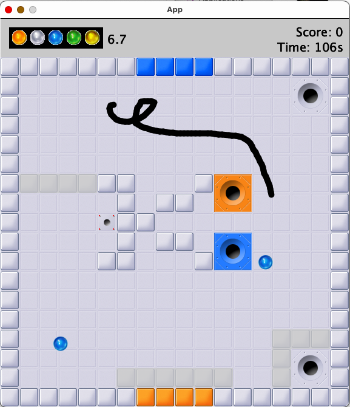

# Inkball

Welcome to Inkball, the classic Microsoft XP game that I recreated using Java's Processing library. I made this game to learn Java and Object-Oriented programming.

## Features
- **Player-drawn lines** to redirect balls.
- **Collision mechanics** with walls and holes.
- **Ball color mechanics**: Balls change color upon hitting special walls.
- **Configurable levels** read from JSON and text files.
- **Game state management** including score tracking, time limits, and level progression.

## Gameplay
The objective of the game is very simple - guide balls into matching holes using player-drawn lines, and progress through all the levels before the timer runs out. 
- Balls spawn and move in random directions.
- Players draw lines to direct balls into matching color holes.
- Balls that enter the wrong hole are penalized.
- The game ends when all balls are successfully captured.

## Game Preview

## Getting Started
1. Clone this repository
2. Ensure that you have **Java 8+**, Processing, and Gradle installed. You can check your Java version by running java -version.

- Level elements can be edited via the respective level.txt files. 
- Level settings, i.e., level duration, spawn timer, can be adjusted in config.json.

N.B: Make sure to disable all the test scripts before building (via 'gradle build' in the terminal). 
- Run the program via 'gradle run' after building
